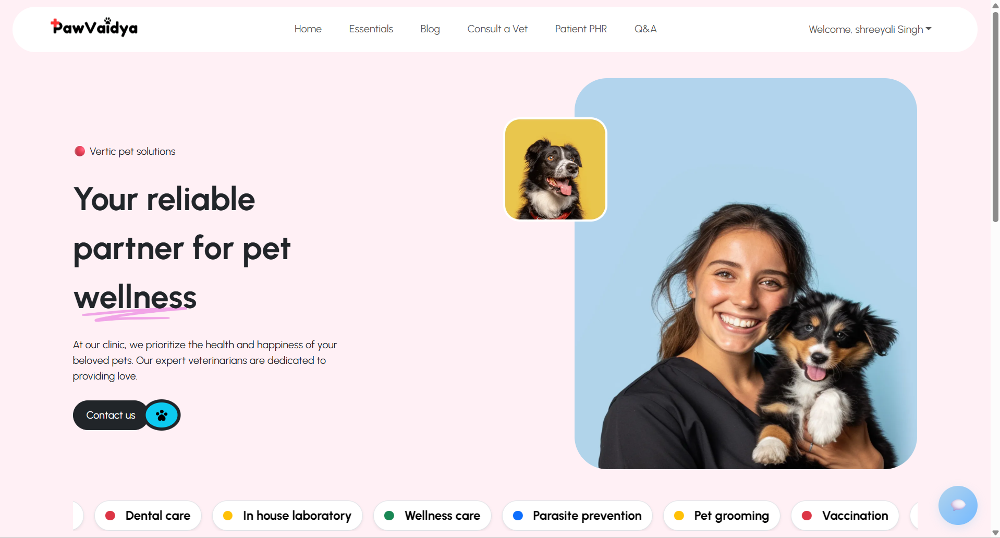
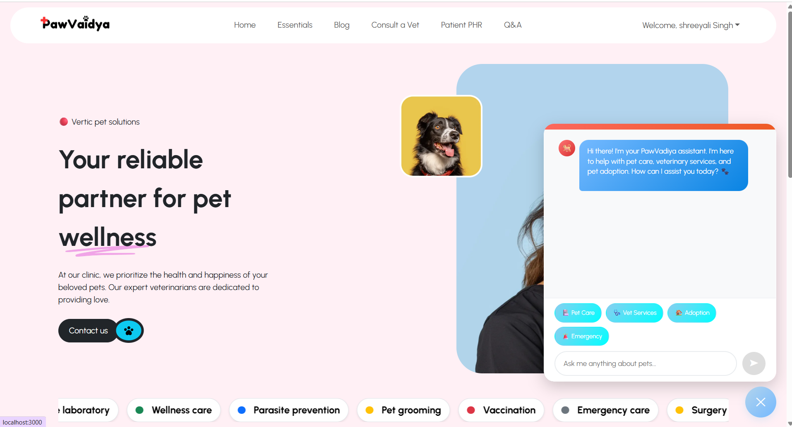
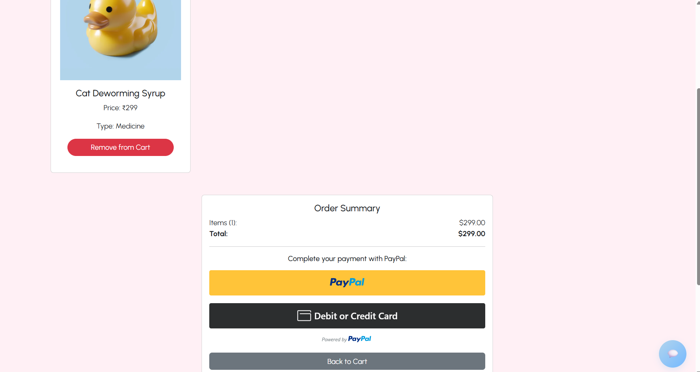
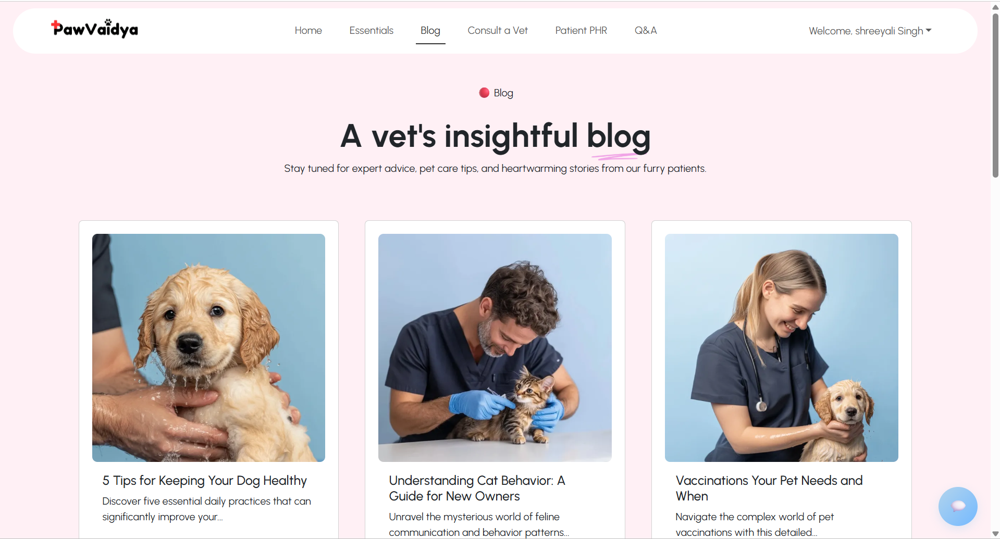
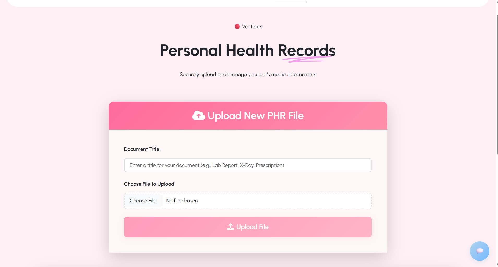

# 🐾 PawVaidya

**PawVaidya** is a veterinary healthcare management system designed to streamline the care, treatment, and tracking of pets and animals. Built with love for animals and passion for technology, this platform aims to assist pet owners and vets by providing a centralized platform for appointments, medical history, prescriptions, and more.

> ⚠️ **Note**: PawVaidya is currently in active development. Contributions, suggestions, and feedback are welcome!

---

## 🚧 Project Status

🚀 **In Development**  
We are currently working on the core feature including  appointment scheduling.

---

## 📌 Features (Planned)

- 🐶 Pet profile creation and medical records tracking  
- 👨‍⚕️ Vet registration and login  
- 📅 Appointment scheduling with reminders  
- 💊 Prescription management  
- 📈 Health tracking dashboards  
- 📂 Upload medical documents and lab reports  
- 🔔 Notifications for vaccinations and checkups
- 📧 Realtime ChatBot for pet healthcare management

---

## 🛠️ Tech Stack

- **Frontend:** React.js / Bootstrap  
- **Backend:** Node.js, Express.js  
- **Database:** MongoDB with Mongoose  
- **Authentication:** Passport
- **Video Conferencing:** Socket.io/ Socket.io-client/ Webrtc
- **Hosting:** Vercel / Render / MongoDB Atlas *(Planned)*

---

## 📦 Installation

```bash
# Clone the repository
git clone https://github.com/Shreeyalisingh/PawVaidya.git
cd pawvaidya

# Install server dependencies
cd server
npm install

# Install client dependencies
cd ../client
npm install

# Run development servers
# Terminal 1
cd server
npm run dev

# Terminal 2
cd client
npm start
```

---
















---


## 🏗️ Built with ❤️ by Shreeyali Singh

Hi, I'm **Shreeyali Singh** — a full-stack developer passionate about solving real-world problems with scalable software. PawVaidya is one of my pet (literally!) projects aimed at blending my love for animals and technology.

- 🔗 [Portfolio](https://shreeyali.vercel.app/)
- 💼 [LinkedIn](https://www.linkedin.com/in/shreeyali-singh26/)
- 💻 [GitHub](https://github.com/Shreeyalisingh)
- 📧 [Email](mailto:shreeyalisingh26@gmail.com)

> Feedback, collaborations, or suggestions? I’d love to hear from you!
